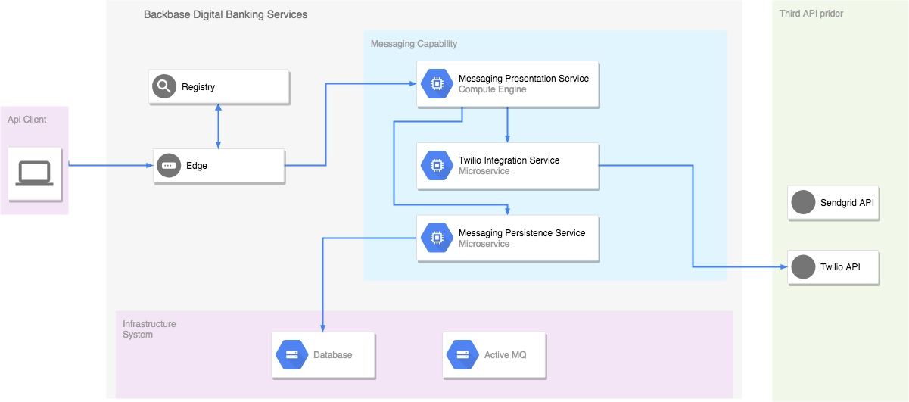

# Twilio Integration Service demo for Backbase DBS Service

[](https://travis-ci.org/Backbase/twilio-integration-service)

This service enables you to setup a Twilio integration service to:

- Send an SMS

## Components

#### Twilio Integration Specfication

Module contains a RAML file that contains the definition of the contracts that is going
to be exposed.


#### Twilio Integration Service

Component that makes the actual integration with Twilio API.

> Check the **Configuration** section for more details

#### Components overview



Installation
============

### Prerequisites

 - JDK 1.8 (PSU >= 131 if using Docker)
 - Apache ActiveMQ 5.14
 - Apache Maven

 > Check community for more details: https://community.backbase.com/documentation/ServiceSDK/latest/deploy_developer_environment

 > for more details of how to run a custom service: https://community.backbase.com/documentation/ServiceSDK/latest/deploy_custom_services


### Configure

The following properties have to be set and obtained from your Twilio account.

```yaml
integration:
  twilio:
    accountSid:
    authToken:
    fromNumber:
```

These properties can be set as environment properties.

```bash
java jar -DSIG_SECRET_KEY=**** \
    -Dintegration.twilio.accountSid=**** \
    -Dintegration.twilio.authToken=**** \
    -Dintegration.twilio.fromNumber=**** \
    twilio-integration-service-1.0.0-boot.war
```

### Build

Build all the artifacts and install it by running the following command

```bash
   mvn clean install
```

Getting Started
============
### Required Environment Properties

Set the following properties (some properties can be updated in `src/main/resources/application.yml`):

  - SIG_SECRET_KEY: Key for signing internal token (The secret length must be at least 256 bits)
  - SPRING_ACTIVEMQ_BROKER_URL: url of the apache MQ
  - SPRING_ACTIVEMQ_USER: user of apache MQ
  - SPRING_ACTIVEMQ_PASSWORD: password of apache MQ

To run the service in development mode, use:

```bash
mvn spring-boot:run
```

To run the service from the built binaries, use:

```bash
java jar -DSIG_SECRET_KEY=**** \
    -Dintegration.twilio.accountSid=**** \
    -Dintegration.twilio.authToken=**** \
    -Dintegration.twilio.fromNumber=**** \
    twilio-integration-service-1.0.0-boot.war
```

The binaries can run in web containers such as:
   - Apache Tomcat 8 (Tested)
   - IBM Liberty Profile (Not Tested)
   - Wildfly


Next Steps
==========

 - Get familiar with Backbase DBS architecture
 - Check Backbase Forums and Community (http://community.backbase.com)

License
=======
Copyright (c) 2018 Backbase B.V.

This Backbase License Agreement (“Agreement”) sets forth the terms and conditions of Your use of the Software that is provided together with this license. If You continue to download the Software, You agree that Your use of the Software, and the use of the Software by any natural or legal person you distribute the Software to, will be covered by this license Agreement. Any third party software that is provided with the Software is included for use at Your option subject to the terms of the license applicable to that software. If You choose to use such software, then such use shall be governed by such third party's license agreement (See Annex A to these terms for an overview of third party software) and not by this Agreement.

1. Definitions

1.1 “Backbase” shall mean Backbase Europe BV, whose place of business is at the INIT Building, Jacob Bontiusplaats 9, 1018 LL Amsterdam, The Netherlands.

1.2 “Documentation” means all online help files or written instruction manuals regarding the Software.

1.3 “Derivative Works” shall mean any Software, whether in source or object form, that is based on (or derived from) the Software and for which the editorial revisions, annotations, elaborations, or other modifications represent, as a whole, an original work of authorship.

1.4 “Licensee” or “You” means the individual who downloads the Software and, if you are downloading the Software to be used for or on behalf of a legal entity, the entity on behalf of which you are downloading the Software.

1.5 “Software” means the object code of the computer program(s) Licensee has downloaded and includes any Documentation as provided.

2. Grant of Rights and Restrictions

2.1 License Grant. Backbase grants to Licensee a non-exclusive, non-transferable right and license to: (a) reproduce, modify and prepare Derivative Works of the Software, and (b) use the Software and Derivative Works for its own internal use and, subject to the conditions in section 2.2, distribute the Software and such Derivative Works as an integrated part of commercial products that Licensee makes available on the market (e.g. mobile apps). Any other form of distribution or reselling the Software is not permitted. Except for the express license granted in this Section 2.1, no other licenses are granted.

2.2 Redistribution. Licensee may distribute the Software and such Derivative Works as an integrated part of commercial products Licensee makes available on the market, provided that Licensee meets the following conditions:

a) Licensee must provide any other recipients to whom it distributes the Software or Derivative Works to, with reasonable notice of these terms and the applicability thereof to the use of the Software. Moreover, Licensee shall require such recipients to agree to the terms of this Agreement including its annexes before making the Software available for download; and
b) Licensee must retain in the Software and Derivative Works any “NOTICE” text files (where such notices normally appear) and all copyright, patent, and trademark notices excluding those notices that do not pertain to any part of the Derivative Works. Contents of the NOTICE file are for informational purposes only and do not modify the License.

c) This License does not grant any rights in the patents, trademarks, service marks, or logos of Backbase (except as may be necessary to comply with the notice requirements in Section 2.2).

3. Warranty Disclaimer and Limitation of Liability

THE SOFTWARE IS PROVIDED ON AN "AS IS", ‘WHERE IS” BASIS, WITHOUT WARRANTY OF ANY KIND, EXPRESS OR IMPLIED, INCLUDING WITHOUT LIMITATION ANY WARRANTIES THAT THE SOFTWARE IS FREE OF DEFECTS, MERCHANTABLE, FIT FOR A PARTICULAR PURPOSE OR NON-INFRINGING. THE ENTIRE RISK AS TO THE QUALITY AND PERFORMANCE OF THE SOFTWARE IS BORNE BY LICENSEE. IN NO EVENT SHALL BACKBASE BE LIABLE, NOR SHALL LICENSEE HOLD BACKBASE LIABLE, FOR ANY CLAIM, DAMAGES OR OTHER LIABILITY, ARISING FROM THE USE OR DISTRIBUTION OF THE SOFTWARE. THIS SECTION 3 CONSTITUTES AN ESSENTIAL PART OF THIS AGREEMENT. THE SOFTWARE MAY NOT BE USED HEREUNDER EXCEPT UNDER THIS DISCLAIMER AND LIMITATION OF LIABILITY.

4. Indemnification by Licensee

Licensee shall defend, indemnify and hold harmless Backbase and its officers, directors, employees and shareholders from and against any and all loss, damage, settlement, costs or expense (including legal expenses and expenses of other professionals), as incurred, resulting from, or arising out of any third party claim which alleges that a Derivative Work infringes upon, misappropriates or violates any intellectual property rights, where such claim is independent of the Software.

5. Applicable Law and Jurisdiction

This Agreement is governed by and interpreted in accordance with the laws of the Netherlands, and Licensee hereby consents to the exclusive jurisdiction and venue of the District Court of Amsterdam.
